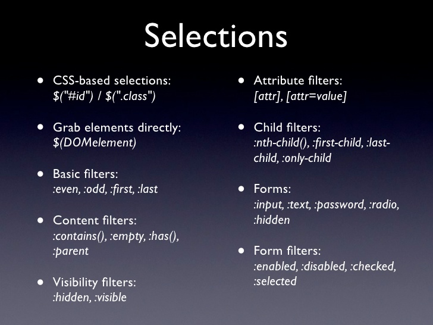

# Libraries and Frameworks
- Libraries, such as jQuery and lodash are focused on providing a set of utility or helper methods to make programming more efficient. 

- Frameworks are more comprehensive, providing capabilities not found in utility JS libraries.

- Frameworks often use libraries to implement their features. But, you'll never find a library using a framework. For an analogy, you can think of libraries as the tools and frameworks as the construction crew.

# jQuery [[RM]](https://api.jquery.com/)


 jQuery is an open-source JavaScript library designed to make front-end development more productive and satisfying, with an end goal of allowing you to do more with less. A good resourse for jQuery can be found [here](https://learn.jquery.com/)


## Your Project and jQuery

- ### Manual 
    Downloading libraries and installing them manuallky to a folder in your project allows you to work on your project without an internet connection. To do this, first you'll want to download and install jQuery somewhere in your project folder. jQuery can be found and downloaded [here](https://jquery.com/download/).

    After jQuery is installed we'll add it to our html file(s). 
    ```html
    <script src="js/jquery-3.2.1.min.js"></script>
    ```

- ### CDN [[RM]](https://en.wikipedia.org/wiki/Content_delivery_network)
Using a CDN can provide performance benefits (especially on mobile devices) and save storage & bandwidth on your server.

```html
<script
   src="https://code.jquery.com/jquery-3.2.1.min.js"
   integrity="sha256-hwg4gsxgFZhOsEEamdOYGBf13FyQuiTwlAQgxVSNgt4="
   crossorigin="anonymous"></script>
```

## Selecting With jQuery
When we want to select something with jQuery we use the jQuery function. `$()`

Selecting all the h1's would look like this:

- `$("h1")`

To refine your seach there's various methods and filters you can add. 



Using the filters above, this is how we'd find the last h1 element in the jQuery object. 
- `$("h1:last-child")`: Selects only the last h1 element. 

## Working with jQuery Objects
Each jQuery method, when used as a setter, returns the updated jQuery object. This allows us to "chain" methods. Example:
```js
$('p')
  .html('Awesome things jQuery can do:')
  .css('background-color', 'peachpuff');
//Longer lines can be broken up like so
```


- `.eq(x)`:Reduce the jQuery set of matched elements to the one at the specified index. (This is the jQuery equivelent to `arrayName[x]`) [Read More](https://api.jquery.com/eq/)

- `.each(function(idx)) {}`: Iterate over a jQuery object, executing a function for each matched element. Unlike arrays.forEach() jQuery give you the index of the current object / element itself. To access the object / element you can use the `this` keyword inside the .each() method. [Read More](https://api.jquery.com/each/)

- `.first()`: Reduce the set of matched elements to the first in the set. [Read More](https://api.jquery.com/first/)

- `.last()`: Reduce the set of matched elements to the last in the set. [Read More](https://api.jquery.com/last/)

- `.hasClass("className")`: Determine whether any of the matched elements are assigned the given class. []

- `.html()`: Get the HTML contents of the first element in the set of matched elements or set the HTML contents of every matched element. [Read More](https://api.jquery.com/html/)

- `.css() `: Get the value of a computed style property for the first element in the set of matched elements or set one or more CSS properties for every matched element. [Read More](https://api.jquery.com/css/)

- `.hasClass()`: Determine whether any of the matched elements are assigned the given class. [Read More](https://api.jquery.com/hasclass/)

- `.addClass()`: Adds the specified class(es) to each element in the set of matched elements [Read More](https://api.jquery.com/addclass/)

- `.removeClass()`: Remove a single class, multiple classes, or all classes from each element in the set of matched elements. [Read More](https://api.jquery.com/removeClass/)

- `.attr("attribute", ...)`: Get the value of an attribute for the first element in the set of matched elements or set one or more attributes for every matched element. [Read More](https://api.jquery.com/attr/)

- `.removeAttr("attribute")`: Remove an attribute from each element in the set of matched elements. [Read More](https://api.jquery.com/removeattr/)

- `.append()`: Insert content, specified by the parameter, to the end of each element in the set of matched elements. [Read More](https://api.jquery.com/append/)

- `.on("event", function(event){...});`: Attach an event handler function for one or more events to the selected elements. [Read Me](https://api.jquery.com/on/)

- `.click(function(event){...});`: Bind an event handler to the "click" JavaScript event, or trigger that event on an element. [Read Me](https://api.jquery.com/click/)

- `.closest("element")`: For each element in the set, get the first element that matches the selector by testing the element itself and traversing up through its ancestors in the DOM tree.

- `.hide()`: Hide the matched elements. [Read More](https://api.jquery.com/hide/)

- `.show()`: Display the matched elements. [Read More](https://api.jquery.com/show/)

- `.toggle()`: Display or hide the matched elements. [Read More](https://api.jquery.com/toggle/)


- `.fadeOut()`: Hide the matched elements by fading them to transparent. [Read More](https://api.jquery.com/fadeOut/)

- `.fadeIn()`: Display the matched elements by fading them to opaque. [Read More](https://api.jquery.com/fadeIn/)
